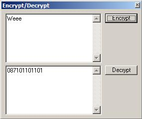



## \[Aurora Borealis\] Simple Encrypt/Decrypt

### Description

A simple encryper/decrypter I made for a friend...

It converts each char into the asc value for that char and reverses it later...
 
### More Info
 

             |
---                |---
**Submitted On**   |
**By**             |[Arcanix](https://github.com/Planet-Source-Code/PSCIndex/blob/master/ByAuthor/arcanix.md)
**Level**          |Intermediate
**User Rating**    |3.5 (28 globes from 8 users)
**Compatibility**  |VB 5\.0, VB 6\.0
**Category**       |[Complete Applications](https://github.com/Planet-Source-Code/PSCIndex/blob/master/ByCategory/complete-applications__1-27.md)
**World**          |[Visual Basic](https://github.com/Planet-Source-Code/PSCIndex/blob/master/ByWorld/visual-basic.md)
**Archive File**   |

### Source Code

<pre>' Place 2 textboxes (txtCoded and txtRea ' l) and 2 command buttons (btndecrypt and ' btnencrypt) on a form
Private Sub btndecrypt_Click()
Dim MyValue As String
MyValue = 3
txtReal.Text = ""
If Len(txtCoded) < 1 Then Exit Sub
For i = 1 To Len(txtCoded) / 3
If MyValue = 3 Then
txtReal = txtReal & Chr(Left(txtCoded, MyValue))
Else
txtReal = txtReal & Chr(Right(Left(txtCoded, MyValue), 3))
End If
MyValue = MyValue + 3
Next i
End Sub
Private Sub btnEncrypt_Click()
Dim MyValue As String
Dim MyValue2 As String
MyValue = 0
MyValue2 = 1
txtCoded = ""
If Len(txtReal) < 1 Then Exit Sub
For i = 1 To Len(txtReal)
txtCoded = txtCoded & Asc(Mid(txtReal, i, 1))
MyValue = MyValue + 1
If Len(txtCoded.Text) < 3 * MyValue Then
 MyValue2 = Right(txtCoded.Text, 2)
 txtCoded.Text = Left(txtCoded.Text, Len(txtCoded.Text) - 2)
 txtCoded.Text = txtCoded.Text & "0" & MyValue2
End If
Next i
End Sub
</pre>

